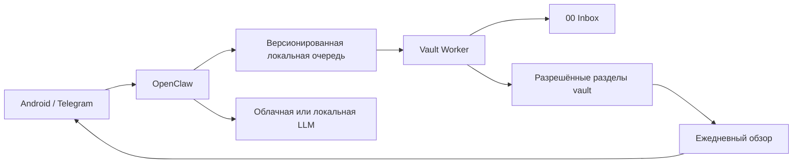

# Obsidian Assistant

Локальный ассистент для безопасного сбора, обработки и распределения заметок в Obsidian.

Проект связывает мобильный входящий поток (в первую очередь Telegram), агентный интерфейс OpenClaw и локальное Obsidian-хранилище. Основной принцип: модель может предлагать действия, но запись в хранилище выполняет отдельный ограниченный компонент по явным правилам.

> Статус: завершён локальный этап Capture. Доступны версионированные события, надёжная файловая очередь, dry-run, идемпотентная запись и карантин. Telegram, OpenClaw, LLM и ежедневные обзоры находятся в дорожной карте и пока не подключены.

## Зачем нужен проект

- отправлять с Android текст, голосовые сообщения и файлы на последующую обработку;
- сохранять исходный материал в `00 Inbox` без потери контекста;
- предлагать проект, задачу, напоминание или постоянную заметку;
- формировать ежедневный обзор с планами и рекомендациями;
- работать круглосуточно на домашнем Mac mini;
- не давать агенту неограниченный доступ к компьютеру и хранилищу.

## Архитектура



OpenClaw будет отвечать за диалог и оркестрацию. Уже реализованная локальная очередь принимает строго проверенное событие и переживает перезапуск. Vault Worker проверяет путь и разрешённый раздел, после чего создаёт заметку. Сетевые интеграции не получают прямой произвольный доступ к vault.

Подробности: [архитектура](docs/architecture.md), [модель угроз](docs/threat-model.md), [контекст проекта](docs/project-context.md).

## Неизменяемые правила безопасности

1. По умолчанию включён `dry-run`.
2. Запись разрешена только в явно перечисленные папки.
3. Базовая операция — создание нового файла без перезаписи существующего.
4. Тесты никогда не используют настоящее пользовательское хранилище.
5. Токены, ключи и пароли не хранятся в Git.
6. MOEX-материалы ограничены безопасными планами, задачами, напоминаниями и обезличенными мыслями.
7. Синхронизация не считается резервной копией.

## Быстрый старт

Требуется Python 3.12 или новее. На первом этапе внешние Python-зависимости не нужны.

```bash
cp .env.example .env
PYTHONPATH=src python3 -m obsidian_assistant --env-file .env doctor
PYTHONPATH=src python3 -m obsidian_assistant --env-file .env capture \
  --title "Проверка входящей заметки" \
  --text "Разобрать идею автоматизации"
```

Последняя команда работает в `dry-run` и ничего не записывает. Для явной записи в тестовый vault:

```bash
PYTHONPATH=src python3 -m obsidian_assistant --env-file .env capture \
  --title "Проверка входящей заметки" \
  --text "Разобрать идею автоматизации" \
  --apply
```

Надёжный поток через очередь:

```bash
PYTHONPATH=src python3 -m obsidian_assistant --env-file .env queue enqueue \
  --title "Идея" \
  --text "Разобрать сценарий мобильного входящего"
PYTHONPATH=src python3 -m obsidian_assistant --env-file .env queue status
PYTHONPATH=src python3 -m obsidian_assistant --env-file .env queue process
```

Последняя команда только покажет будущий путь, пока включён `OBSIDIAN_DRY_RUN=true`. Для записи в намеренно выбранный тестовый vault добавьте `--apply`. Полный жизненный цикл и восстановление описаны в [руководстве по Capture](docs/capture-queue.md).

Проверки:

```bash
make check
```

Запуск в контейнере описан в [руководстве разработчика](docs/development.md).

## Текущие возможности

- загрузка безопасной конфигурации из окружения или `.env`;
- диагностика пути к vault и разрешённых папок;
- нормализация имени заметки;
- защита от абсолютных путей, `..` и выхода через симлинки;
- эксклюзивное создание Markdown-файла без перезаписи;
- версионированное событие `capture.text` и проверка его fingerprint;
- файловая очередь вне vault с блокировкой одного хоста;
- идемпотентность по `request_id`, повторные попытки и карантин;
- metadata-only квитанция после успешной обработки;
- корректный минимальный frontmatter;
- тестовый vault и автоматические проверки GitHub Actions.

## Документация

- [Продукт и границы](docs/product.md)
- [Контекст и память проекта](docs/project-context.md)
- [Архитектура](docs/architecture.md)
- [Capture и локальная очередь](docs/capture-queue.md)
- [Дорожная карта](docs/roadmap.md)
- [Разработка](docs/development.md)
- [Развёртывание на Mac mini](docs/deployment-macos.md)
- [Эксплуатация](docs/operations.md)
- [Модель угроз](docs/threat-model.md)
- [Архитектурные решения](docs/decisions/README.md)
- [Публикация на GitHub](docs/publishing-checklist.md)

## Публикация и лицензия

Проект распространяется по открытой [лицензии MIT](LICENSE). Проверки перед публичным релизом перечислены в [чек-листе публикации](docs/publishing-checklist.md).

## Состояние проекта

Изменения фиксируются в [CHANGELOG.md](CHANGELOG.md). Текущие и следующие этапы определены в [roadmap](docs/roadmap.md). Существенные технические решения принимаются через ADR, чтобы будущая поддержка не зависела от памяти одного человека.
