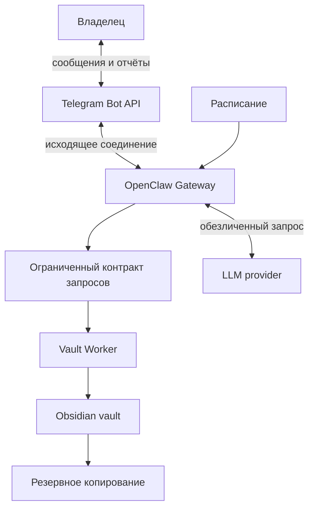

# Архитектура

## Цели архитектуры

- сохранить исходные входящие даже при недоступности модели;
- отделить доверенный файловый компонент от сетевого агента;
- сделать все пути и интеграции заменяемыми конфигурацией;
- обеспечить безопасный перенос с локального Mac на Mac mini;
- постепенно расширять права, не начиная с автономного доступа.

## Контекст системы



## Компоненты

### OpenClaw

Отвечает за канал общения, сессии, расписание и вызов разрешённых возможностей. Gateway должен быть привязан к loopback и принимать сообщения только от allowlist пользователя.

### Vault Worker

Единственный компонент, имеющий право записывать в vault. Получает структурированную операцию, проверяет политику и выполняет её без интерпретации произвольных shell-команд.

Текущий фундамент реализует:

- загрузку конфигурации;
- диагностику;
- безопасное разрешение пути;
- создание новой входящей Markdown-заметки.

### Контракт запросов

Будущий контракт должен быть версионированным и содержать минимум:

```json
{
  "schema_version": 1,
  "request_id": "uuid",
  "actor_id": "telegram-user-id",
  "operation": "capture_text",
  "target": "00 Inbox",
  "payload": {},
  "created_at": "RFC3339 timestamp"
}
```

Полный текст может находиться в payload, но не должен автоматически копироваться в лог. Для первой серверной версии предпочтительна локальная очередь файлов или Unix socket: они позволяют не открывать сетевой порт Vault Worker.

### Obsidian vault

Источник истины для заметок. Сервис использует обычные Markdown-файлы и минимальный YAML frontmatter. Конкретный путь задаётся `OBSIDIAN_VAULT_PATH`.

### LLM adapter

Изолирует поставщика модели. Недоступность модели не блокирует capture. Результат модели рассматривается как недоверенное предложение и повторно валидируется политикой.

## Границы доверия

1. **Внешний канал → OpenClaw:** входящий текст недоверенный; требуется allowlist отправителей.
2. **OpenClaw → LLM:** данные могут покинуть домашнюю инфраструктуру; применяется политика данных.
3. **OpenClaw → Vault Worker:** только известные операции и схема; произвольные команды запрещены.
4. **Vault Worker → vault:** путь должен находиться внутри корня и разрешённой папки.
5. **Vault → backup/sync:** синхронизация и резервное копирование имеют разные назначения.

## Контракт записи

Каждая операция записи обязана:

1. принять относительный путь;
2. отклонить абсолютный путь, `..` и выход через симлинк;
3. проверить верхний разрешённый каталог;
4. по умолчанию сформировать предварительный результат;
5. при применении создать новый файл с флагом exclusive create;
6. никогда не перезаписывать существующий файл;
7. вернуть идентификатор и относительный путь без полного текста заметки в логе.

## Развёртывание

Целевая топология — один доверенный владелец и один Mac mini. OpenClaw запускается под отдельным непривилегированным пользователем. Vault Worker может запускаться в ограниченном контейнере или как отдельный сервис с минимальным доступом к файловой системе.

Подробный переход описан в [deployment-macos.md](deployment-macos.md).
