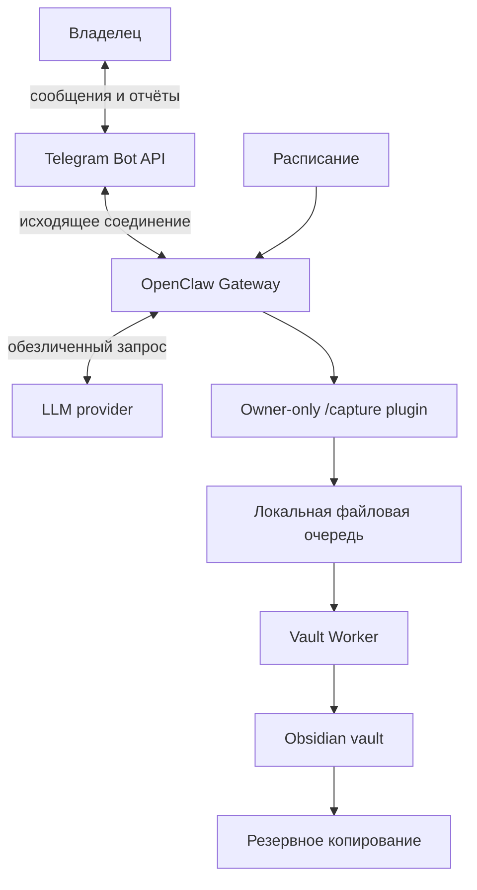
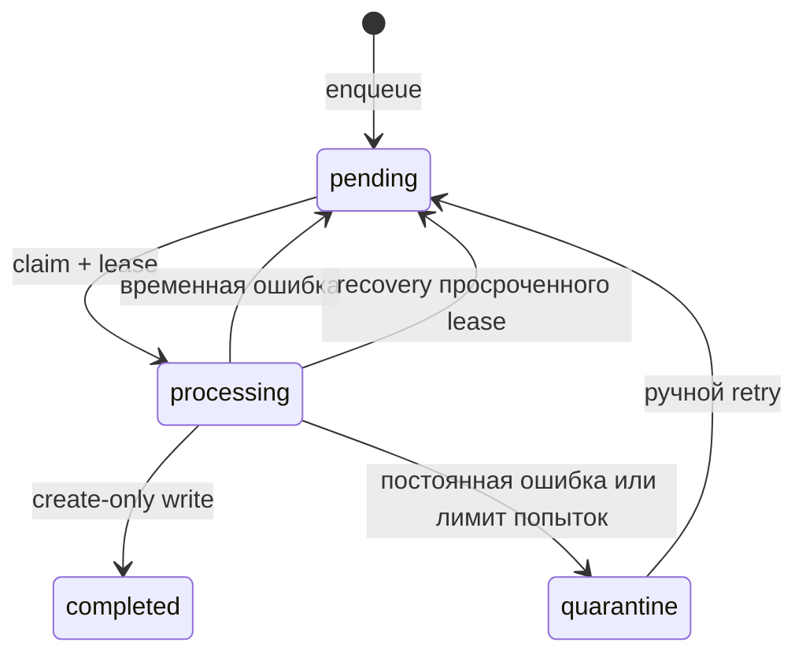

# Архитектура

## Цели архитектуры

- сохранить исходные входящие даже при недоступности модели;
- отделить доверенный файловый компонент от сетевого агента;
- сделать все пути и интеграции заменяемыми конфигурацией;
- обеспечить безопасный перенос с локального Mac на Mac mini;
- постепенно расширять права, не начиная с автономного доступа.

## Контекст системы



## Компоненты

### OpenClaw

Отвечает за канал общения, сессии, расписание и вызов разрешённых возможностей. Gateway должен быть привязан к loopback и принимать сообщения только от allowlist пользователя.

Нативный Telegram-канал OpenClaw является единственным клиентом Bot API и использует long polling. Команда `/capture` регистрируется плагином и выполняется без LLM. Плагин не получает общий shell: он может запустить только настроенный абсолютный bridge executable с фиксированными аргументами.

### Vault Worker

Единственный компонент, имеющий право записывать в vault. Получает структурированную операцию, проверяет политику и выполняет её без интерпретации произвольных shell-команд.

Текущий фундамент реализует:

- загрузку конфигурации;
- диагностику;
- безопасное разрешение пути;
- создание новой входящей Markdown-заметки;
- идемпотентную обработку очереди и восстановление после сбоя;
- обработку конкретного интерактивного request ID для немедленного metadata-ответа.

### OpenClaw Capture bridge

Плагин и worker разделены процессной границей. Событие передаётся через stdin в строгой оболочке версии 1; текст не попадает в argv. Worker запускается с отдельным env-файлом без Telegram, Gateway и LLM-секретов. Плагин получает только `accepted`, состояния очереди/обработки, request ID и безопасный относительный путь.

Решение и причины: [ADR-0007](decisions/0007-use-openclaw-native-telegram-and-typed-capture-command.md). Руководство запуска: [openclaw-telegram.md](openclaw-telegram.md).

### Контракт запросов

Контракт `capture.text` версии 1 содержит:

```json
{
  "schema_version": 1,
  "request_id": "12345678-1234-5678-1234-567812345678",
  "event_type": "capture.text",
  "source": "local",
  "actor_id": "local-owner",
  "created_at": "2026-07-16T09:30:00.000000Z",
  "payload": {
    "title": "Тестовая идея",
    "text": "Обезличенный тестовый материал"
  }
}
```

Полный текст находится в payload только в состояниях `pending`, `processing` и `quarantine` и не копируется в обычный лог. После успеха событие заменяется квитанцией с fingerprint и относительным путём заметки. Очередь хранится в `OBSIDIAN_RUNTIME_PATH` вне vault и не открывает сетевой порт Vault Worker. Подробная схема: [capture-queue.md](capture-queue.md).

### Жизненный цикл очереди



`request_id` и SHA-256 канонического события защищают от повторной доставки с другим содержимым. Один файловый lock сериализует изменение состояния на одном Mac mini. Это не распределённая очередь и не предназначено для нескольких серверов с общим сетевым диском.

### Obsidian vault

Источник истины для заметок. Сервис использует обычные Markdown-файлы и минимальный YAML frontmatter. Конкретный путь задаётся `OBSIDIAN_VAULT_PATH`.

### LLM adapter

Изолирует поставщика модели. Недоступность модели не блокирует capture. Результат модели рассматривается как недоверенное предложение и повторно валидируется политикой.

## Границы доверия

1. **Внешний канал → OpenClaw:** входящий текст недоверенный; требуется numeric allowlist отправителей.
2. **OpenClaw → LLM:** данные могут покинуть домашнюю инфраструктуру; применяется политика данных.
3. **OpenClaw → Vault Worker:** только `/capture`, фиксированный executable и известная схема через stdin; shell и произвольные команды запрещены.
4. **Vault Worker → vault:** путь должен находиться внутри корня и разрешённой папки.
5. **Vault → backup/sync:** синхронизация и резервное копирование имеют разные назначения.

## Контракт записи

Каждая операция записи обязана:

1. принять относительный путь;
2. отклонить абсолютный путь, `..` и выход через симлинк;
3. проверить верхний разрешённый каталог;
4. по умолчанию сформировать предварительный результат;
5. при применении создать новый файл с флагом exclusive create;
6. никогда не перезаписывать существующий файл;
7. вернуть идентификатор и относительный путь без полного текста заметки в логе.

## Развёртывание

Целевая топология — один доверенный владелец и один Mac mini. OpenClaw запускается под отдельным непривилегированным пользователем. Vault Worker может запускаться в ограниченном контейнере или как отдельный сервис с минимальным доступом к файловой системе.

Подробный переход описан в [deployment-macos.md](deployment-macos.md).
