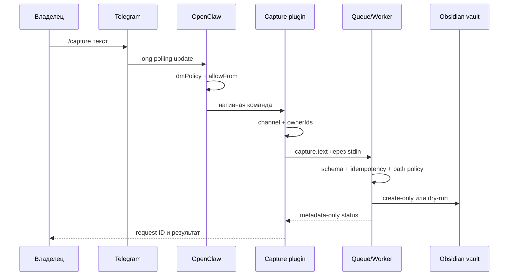

# Telegram и OpenClaw

## Что реализовано

OpenClaw является единственным Telegram-клиентом и использует исходящий long polling. Плагин `obsidian-assistant-capture` добавляет `/capture`, проверяет владельца и передаёт событие локальному Vault Worker без LLM и без shell.



Обычный текст, не начинающийся с `/capture`, остаётся обычным сообщением OpenClaw. Подключение LLM будет отдельным этапом; Capture уже работает без него.

## Требования

- OpenClaw `2026.7.1`;
- Node.js `22.22.3+` в ветке 22, `24.15.0+` в ветке 24 или поддерживаемая более новая ветка;
- Python 3.12+;
- один Telegram bot token и один numeric Telegram user ID;
- локальные vault и runtime на том же Mac.

Локальный MacBook сейчас может собирать и тестировать плагин на Node 20, но это не является поддерживаемым runtime для OpenClaw. Gateway запускаем после установки подходящей версии Node на Mac mini.

## Подготовка Telegram

1. В официальном `@BotFather` создать отдельного бота командой `/newbot`.
2. Сохранить bot token только в `~/.openclaw/.env` целевого пользователя.
3. Узнать собственный numeric Telegram user ID. Username не использовать как границу доступа.
4. В BotFather запретить добавление бота в группы через `/setjoingroups`, если группы не нужны.

Проект не использует webhook. Не настраивайте публичный домен, reverse proxy или проброс порта ради Telegram.

## Сборка worker и плагина

Из корня репозитория:

```bash
python3.12 -m venv .venv
.venv/bin/pip install .
cd integrations/openclaw-capture
npm ci
npm run check
npm pack --pack-destination /tmp
```

Установить полученный tarball штатным менеджером OpenClaw и проверить runtime:

```bash
openclaw plugins install npm-pack:/tmp/gmlol11-openclaw-obsidian-capture-0.1.0.tgz --force
openclaw plugins inspect obsidian-assistant-capture --runtime --json
```

## Разделение конфигурации и секретов

Используются три файла с разными полномочиями:

| Файл | Содержит | Не должен содержать |
|---|---|---|
| `~/.openclaw/.env` | bot token, Gateway token, owner ID, пути к bridge | текст заметок |
| `~/.openclaw/openclaw.json` | allowlist, loopback, tool policy, конфигурацию плагина | literal tokens |
| `worker.env` | vault/runtime paths, allowed dirs, `dry-run` | Telegram, Gateway или LLM credentials |

Шаблоны находятся в `deploy/openclaw`. На целевом Mac:

```bash
cp deploy/openclaw/openclaw.env.example ~/.openclaw/.env
cp deploy/openclaw/openclaw.example.json5 ~/.openclaw/openclaw.json
cp deploy/openclaw/worker.env.example ./worker.env
chmod 600 ~/.openclaw/.env ~/.openclaw/openclaw.json ./worker.env
```

Заполнить значения локально. Не присылать token в чат и не добавлять заполненные файлы в Git. `OBSIDIAN_ASSISTANT_COMMAND` и `OBSIDIAN_WORKER_ENV_FILE` должны быть абсолютными путями.

## Первый безопасный запуск

Оставить `OBSIDIAN_DRY_RUN=true` и выполнить:

```bash
openclaw doctor
openclaw security audit --deep
openclaw gateway
openclaw channels status --probe
```

До запуска Gateway deep audit ожидаемо сообщает, что probe к `127.0.0.1:18789` не удался. При строго локальном loopback без reverse proxy предупреждение о пустом `trustedProxies` не требует добавлять прокси только ради тишины; публичную публикацию Control UI не включать.

Затем в личном чате с ботом:

```text
/capture Проверка dry-run
```

Ожидаемый ответ содержит `🧪`, request ID и будущий относительный путь. Файл в vault пока не создаётся, событие остаётся в `pending`.

После проверки пути и allowlist изменить только worker-файл на `OBSIDIAN_DRY_RUN=false`, перезапустить Gateway и повторить тест с новым текстом. Ожидаемый ответ содержит `✅ Сохранено`, а новый Markdown-файл появляется в `00 Inbox` без перезаписи существующих файлов.

Многострочный формат:

```text
/capture Заголовок заметки
Текст заметки
```

При одной строке используется нейтральный заголовок `Telegram capture`, а вся строка сохраняется как текст.

## Проверка границ

Перед постоянным запуском подтвердить:

- другой Telegram account не получает доступ к команде;
- сообщения в группах блокируются;
- Gateway слушает только loopback;
- `openclaw security audit --deep` не показывает критических проблем;
- plugin inspect показывает версию и загруженный runtime;
- worker env не содержит `TELEGRAM_BOT_TOKEN`, Gateway token или ключ модели;
- stdout/stderr и Telegram-ответ не содержат полный текст заметки;
- повторное выполнение bridge с тем же request ID не создаёт второй файл.

## Ограничения текущего этапа

- создание реального бота и security audit требуют доступа к Mac mini и локальных секретов;
- голос, файлы и автоматическое распределение по проектам ещё не реализованы;
- обычный диалог OpenClaw потребует настройки модели на следующем этапе;
- уведомления о фоновой обработке пока не отправляются отдельным сообщением: при `processImmediately=true` результат возвращается в ответ на `/capture`, при `false` возвращается подтверждение очереди.
